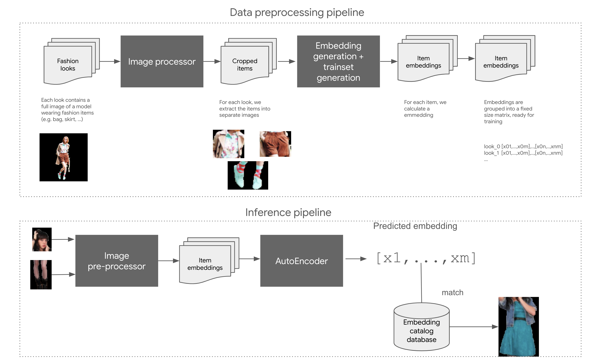
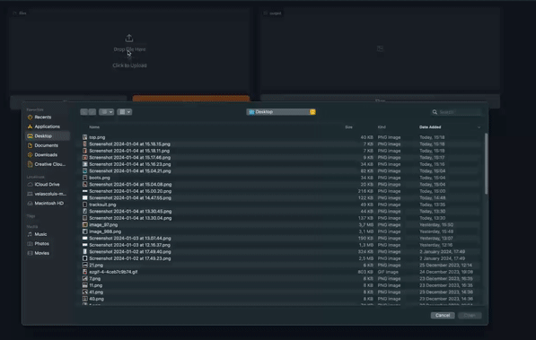

# Next semantic embedding prediction with Autoencoders

- 

This [notebook](src/fashion_embedding_prediction.ipynb) contains a sample implementation of next embedding prediction using an Autoencoder architecture.
- Given a set of N "valid" embeddings, the model will learn to generate the "missing" embedding given N-1 embeddings.
    -  For example the training set could looks like:
```code        
                features           label
            --------------     -----------
example_1, [1,2,3],[3,4,5],...,[m-2,m-1,m]
example_2, [1,2,3],[3,4,5],...,[m-2,m-1,m]
...
example_n, [1,2,3],[3,4,5],...,[m-2,m-1,m]
```
- The model will learn the implicit relation between the embeddings and produce reconstructued outputs in case some parts (embeddings) are missing.
- This concept can be applied to very different settings, but in this example, we apply this idea for implement a basic "Fashion - Complete your look"

- 

The notebook contains the examples based on two datases:
 - Small - Using the `Fashion MNIST` dataset
 - Large - Using the `ChictopiaPlus10k` dataset, GPU strongly recommeded
